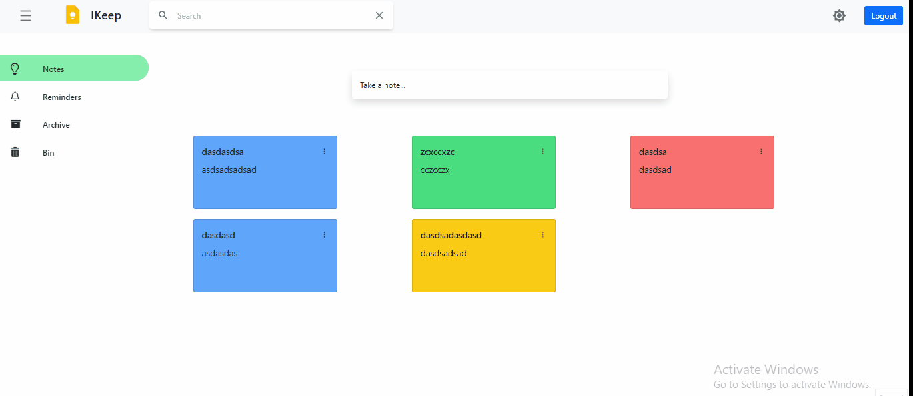
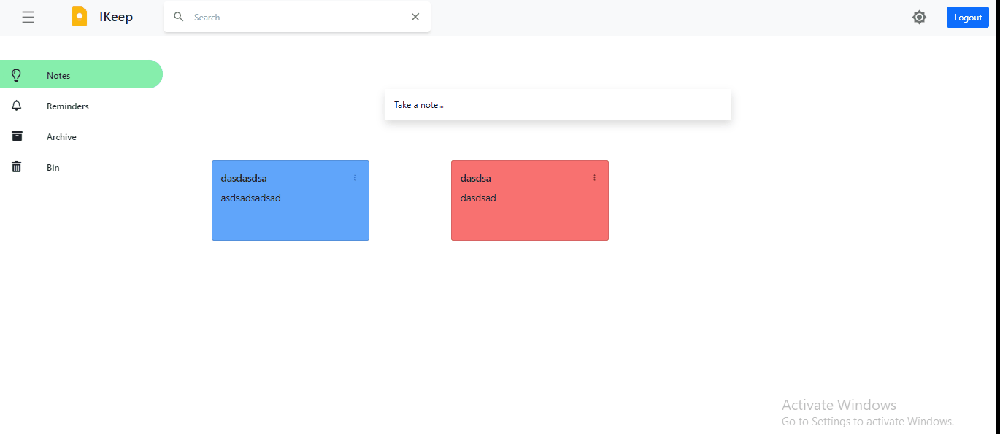
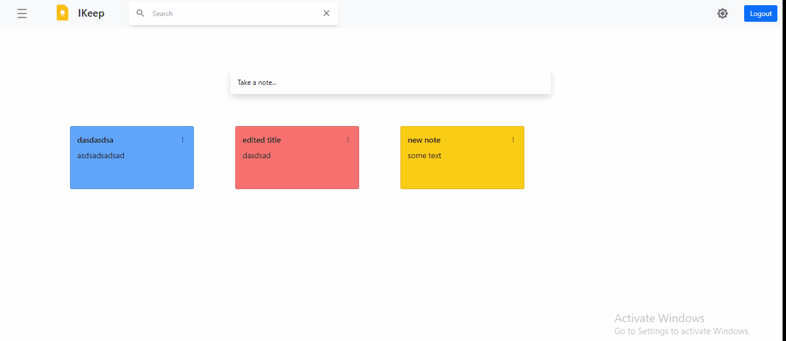
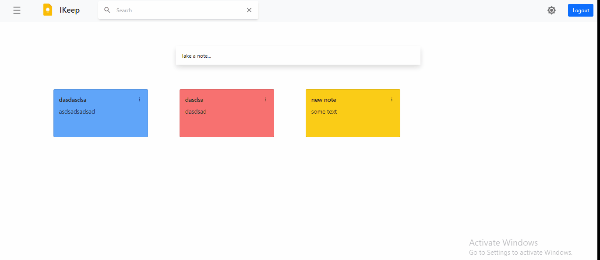
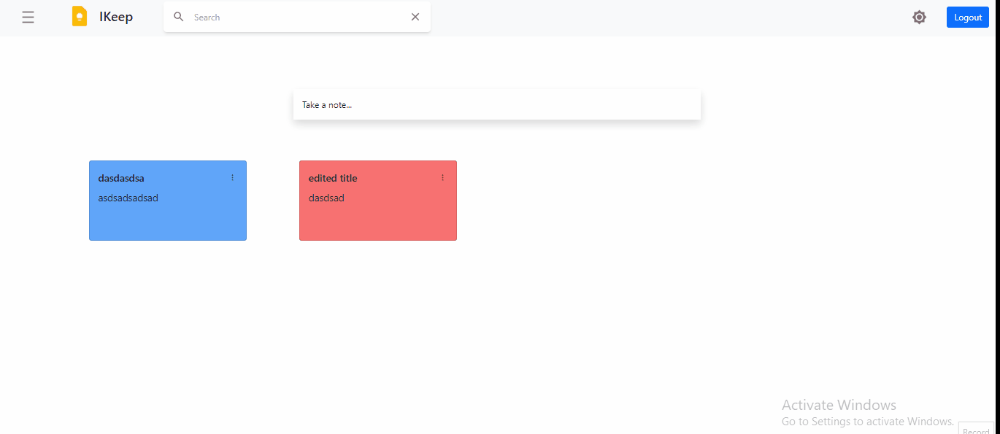

#  A Clone of Google Keep

A minimal *Clone* of [Google Keep](https://keep.google.com) written in [ReactJS](https://reactjs.org/) with [Material UI Components](https://material-ui.com/), themed to look exactly like *Google Keep*, with complex features like sharing, archiving, reminders etc. shoved away. The backend is a [Node.js](https://nodejs.org/en/) server written in [Express.js](https://expressjs.com/), with data persisted in [Mongodb](https://www.mongodb.com/). The server implementation is complete with *Jason Web Token  based Authentication*, implemented using [jsonwebtoken](https://www.npmjs.com/package/jsonwebtoken).


<div align="center">


<br/>*Light and Dark theme*

</div>

<div align="center">


<br/>*Add notes demo*

</div>

<div align="center">


<br/>*Delete notes demo*

</div>

<div align="center">


<br/>*Edit notes demo*

</div>

<div align="center">


<br/>*Edit notes demo*

</div>
## Features

* 🔐 **Login** & 🔏 **Register** for creating a new user

* 🌈 **Colors**, 📐 **Sizes**, ❮❯ **Margins**, ❯❮ **Paddings** etc., matches exactly that of *Google Keep*'s Web App

* 📲 **Responsive Design** - Adapts all screen sizes from mobile screens up to 4k displays

* 🌚 **Dark Mode** - Dynamically change light/dark theme

* 📝 **Notes** - Create, Update, *Copy*, Delete items on the fly. Dynamically change between these 2 modes

  * 🗒 **Simple Notes** - Update/delete text in a simple text mode

* 🚥 **Colors** - Assign colors to Notes & adapts to dark/light theme

*  🏷 **Labels** - Label your notes, assign/unassign labels dynamically and filter notes by selecting labels in Sidebar

* 🔗 **Subscriptions** - When notes are created/deleted in different browser tabs, the updates are pushed from server to client


## Design


This diagram explains the high-level architecture design of this project. This stack is a *MERN*, with frontend-backend-database all packed into one single *container* deployment. Frontend is a *ReactJS* stack. 

The **Frontend** is built with *ReactJS* using *Material UI React* components. The state management is through *React's Hooks for State, Context & Reducer* (see [`store.js`](web/src/store.js)). The main application is available at root `/`, which on load tries to load the noteitems. 

Since the user will not authenticated by this time, the *Router* navigates the user to `/login` where the user can enter `email` & `password` to login. To register for a new user, the user clicks on the 'Register' link to navigate to `/register` route. The user may enter any `name`, `email` (no email verification in place) and `password`. All Login & Registration HTTP calls are REST and are made via *Axios* React *Hooks* API.

Once logged in, a session cookie will be set in the browser. Now, the *GraphQL* API is available at `/query` and *URQL* client loads all the *Notes*, *Labels* & *User* information, in a single *query* (However, has to be optimised, as URQL's caching mechanism, makes involuntary calls, whenever any of the *mutation* happens). UI displays the items. User may create, update, delete *note* items, and may also create & assign/unassign labels to note items. The *labels* may be added, but update/delete hasn't be implemented now. User can sign out, by clicking the 'Profile' icon and then 'Sign Out' button.

The **Backend** is built with *Nodejs* and no server framework is used, except *Express.js*. 

The DB is a *MongoDB*, *mongoose* allows quick and easy Database modelling.


## How to Setup and Run

### Method 1: Docker

1) Clone the Git repository

```sh
git clonehttps://github.com/harsh1493/iKeep.git
```

2) CD into the folder

```sh
cd IKeep
```

3) Install dependencies for both frontend and backend

```sh
npm i
cd backend
npm i
cd ..
```

4) run both server and react app using both.js script defined in package.json

```sh
npm run both
```

5) Launches https://localhost:3000 in the browser

## License

```
MIT License

Copyright (c) 2020 Merbin J Anselm

Permission is hereby granted, free of charge, to any person obtaining a copy
of this software and associated documentation files (the "Software"), to deal
in the Software without restriction, including without limitation the rights
to use, copy, modify, merge, publish, distribute, sublicense, and/or sell
copies of the Software, and to permit persons to whom the Software is
furnished to do so, subject to the following conditions:

The above copyright notice and this permission notice shall be included in all
copies or substantial portions of the Software.

THE SOFTWARE IS PROVIDED "AS IS", WITHOUT WARRANTY OF ANY KIND, EXPRESS OR
IMPLIED, INCLUDING BUT NOT LIMITED TO THE WARRANTIES OF MERCHANTABILITY,
FITNESS FOR A PARTICULAR PURPOSE AND NONINFRINGEMENT. IN NO EVENT SHALL THE
AUTHORS OR COPYRIGHT HOLDERS BE LIABLE FOR ANY CLAIM, DAMAGES OR OTHER
LIABILITY, WHETHER IN AN ACTION OF CONTRACT, TORT OR OTHERWISE, ARISING FROM,
OUT OF OR IN CONNECTION WITH THE SOFTWARE OR THE USE OR OTHER DEALINGS IN THE
SOFTWARE.

```
